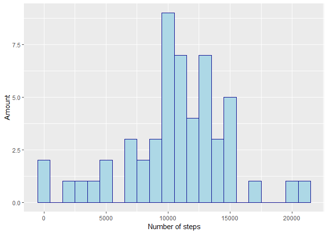
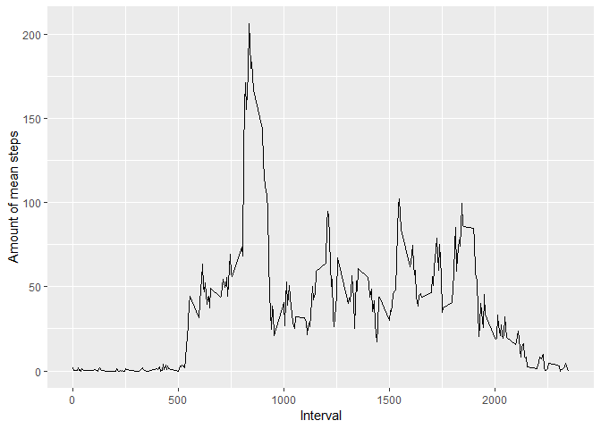
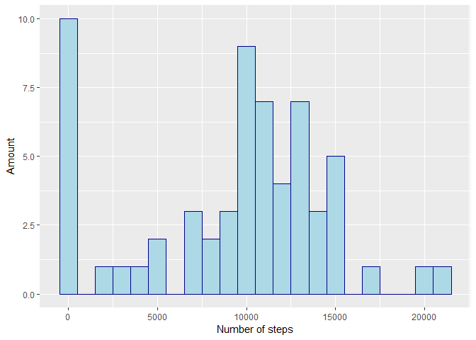
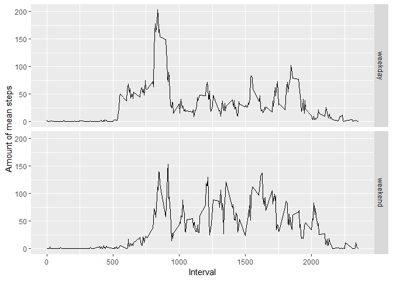

This assignment makes use of data from a personal activity monitoring device. This device collects data at 5 minute intervals through out the day. The data consists of two months of data from an anonymous individual collected during the months of October and November, 2012 and include the number of steps taken in 5 minute intervals each day.

Dataset source: [Activity monitoring data](https://d396qusza40orc.cloudfront.net/repdata%2Fdata%2Factivity.zip), 19.08.2018

## Loading and preprocessing the data
1. load data and package for plotting
2. create a dataset without NAs
3. take a look at the data to get an idea of the content


```r
      library(ggplot2)
```

```
## Warning: package 'ggplot2' was built under R version 3.5.1
```

```r
      data <- read.csv("activity/activity.csv", header = TRUE, sep = ",")
      head(data)
```

```
##   steps       date interval
## 1    NA 2012-10-01        0
## 2    NA 2012-10-01        5
## 3    NA 2012-10-01       10
## 4    NA 2012-10-01       15
## 5    NA 2012-10-01       20
## 6    NA 2012-10-01       25
```

```r
      str(data)
```

```
## 'data.frame':	17568 obs. of  3 variables:
##  $ steps   : int  NA NA NA NA NA NA NA NA NA NA ...
##  $ date    : Factor w/ 61 levels "2012-10-01","2012-10-02",..: 1 1 1 1 1 1 1 1 1 1 ...
##  $ interval: int  0 5 10 15 20 25 30 35 40 45 ...
```

```r
      summary(data)
```

```
##      steps                date          interval     
##  Min.   :  0.00   2012-10-01:  288   Min.   :   0.0  
##  1st Qu.:  0.00   2012-10-02:  288   1st Qu.: 588.8  
##  Median :  0.00   2012-10-03:  288   Median :1177.5  
##  Mean   : 37.38   2012-10-04:  288   Mean   :1177.5  
##  3rd Qu.: 12.00   2012-10-05:  288   3rd Qu.:1766.2  
##  Max.   :806.00   2012-10-06:  288   Max.   :2355.0  
##  NA's   :2304     (Other)   :15840
```

```r
      dataComp <- data[complete.cases(data), ]
      head(dataComp)
```

```
##     steps       date interval
## 289     0 2012-10-02        0
## 290     0 2012-10-02        5
## 291     0 2012-10-02       10
## 292     0 2012-10-02       15
## 293     0 2012-10-02       20
## 294     0 2012-10-02       25
```

```r
      str(dataComp)
```

```
## 'data.frame':	15264 obs. of  3 variables:
##  $ steps   : int  0 0 0 0 0 0 0 0 0 0 ...
##  $ date    : Factor w/ 61 levels "2012-10-01","2012-10-02",..: 2 2 2 2 2 2 2 2 2 2 ...
##  $ interval: int  0 5 10 15 20 25 30 35 40 45 ...
```

```r
      summary(dataComp)
```

```
##      steps                date          interval     
##  Min.   :  0.00   2012-10-02:  288   Min.   :   0.0  
##  1st Qu.:  0.00   2012-10-03:  288   1st Qu.: 588.8  
##  Median :  0.00   2012-10-04:  288   Median :1177.5  
##  Mean   : 37.38   2012-10-05:  288   Mean   :1177.5  
##  3rd Qu.: 12.00   2012-10-06:  288   3rd Qu.:1766.2  
##  Max.   :806.00   2012-10-07:  288   Max.   :2355.0  
##                   (Other)   :13536
```
  

## What is mean total number of steps taken per day?
1. Calculate the total number of steps taken per day
2. If you do not understand the difference between a histogram and a barplot, research the difference between them. Make a histogram of the total number of steps taken each day
3. Calculate and report the mean and median of the total number of steps taken per day

```r
      StepsPerDay <- aggregate(dataComp$steps, by=list(dataComp$date), FUN=sum)
      names(StepsPerDay) = c("Date", "Steps")
      ggplot(StepsPerDay, aes(Steps)) + geom_histogram(binwidth=1000, color="darkblue", fill="lightblue") + xlab('Number of steps') + ylab('Amount')
```

<!-- -->

```r
      medianStepsPerDay = median(StepsPerDay$Steps, na.rm=TRUE)
      meanStepsPerDay  = mean(StepsPerDay$Steps, na.rm = TRUE)
```
Mean steps taken per day: 1.0766189\times 10^{4}

Median steps taken per day: 10765 

## What is the average daily activity pattern?
1. Make a time series plot (i.e. type="l") of the 5-minute interval (x-axis) and the average number of steps taken, averaged across all days (y-axis)
2. Which 5-minute interval, on average across all the days in the dataset, contains the maximum number of steps?

```r
      meanStepsPerInterval <- aggregate(dataComp$steps, by=list(dataComp$interval), FUN=mean)
      names(meanStepsPerInterval) = c("Interval", "MeanSteps")
      ggplot(meanStepsPerInterval, aes(Interval, MeanSteps)) + geom_line() + xlab('Interval') + ylab('Amount of mean steps')
```

<!-- -->

```r
      maxInt <- meanStepsPerInterval[which.max(meanStepsPerInterval$MeanSteps), ]
```
Interval with the maximum average number of steps: 835

## Imputing missing values
Note that there are a number of days/intervals where there are missing values (coded as NA). The presence of missing days may introduce bias into some calculations or summaries of the data.

1. Calculate and report the total number of missing values in the dataset (i.e. the total number of rows with NAs)
2. Devise a strategy for filling in all of the missing values in the dataset. The strategy does not need to be sophisticated. For example, you could use the mean/median for that day, or the mean for that 5-minute interval, etc.
3. Create a new dataset that is equal to the original dataset but with the missing data filled in.
4. Make a histogram of the total number of steps taken each day and Calculate and report the mean and median total number of steps taken per day. Do these values differ from the estimates from the first part of the assignment? What is the impact of imputing missing data on the estimates of the total daily number of steps?


```r
      sumNA <- sum(is.na(data))
```
The total number of NAs in the dataset is 2304 (also already displayed in the summary in the beginning of this document)

Regarding the missing values there could be a number of possibilities where they come from. One reason could be, that there are simply no values which could have been used. Since there aren't any registered steps I am assuming a step count of 0 for the missing values.


```r
      dataFilled <- data
      dataFilled[is.na(dataFilled), 1] <- 0
      head(dataFilled)
```

```
##   steps       date interval
## 1     0 2012-10-01        0
## 2     0 2012-10-01        5
## 3     0 2012-10-01       10
## 4     0 2012-10-01       15
## 5     0 2012-10-01       20
## 6     0 2012-10-01       25
```

```r
      str(dataFilled)
```

```
## 'data.frame':	17568 obs. of  3 variables:
##  $ steps   : num  0 0 0 0 0 0 0 0 0 0 ...
##  $ date    : Factor w/ 61 levels "2012-10-01","2012-10-02",..: 1 1 1 1 1 1 1 1 1 1 ...
##  $ interval: int  0 5 10 15 20 25 30 35 40 45 ...
```

```r
      summary(dataFilled)
```

```
##      steps                date          interval     
##  Min.   :  0.00   2012-10-01:  288   Min.   :   0.0  
##  1st Qu.:  0.00   2012-10-02:  288   1st Qu.: 588.8  
##  Median :  0.00   2012-10-03:  288   Median :1177.5  
##  Mean   : 32.48   2012-10-04:  288   Mean   :1177.5  
##  3rd Qu.:  0.00   2012-10-05:  288   3rd Qu.:1766.2  
##  Max.   :806.00   2012-10-06:  288   Max.   :2355.0  
##                   (Other)   :15840
```

```r
      StepsPerDay <- aggregate(dataFilled$steps, by=list(dataFilled$date), FUN=sum)
      names(StepsPerDay) = c("Date", "Steps")
      ggplot(StepsPerDay, aes(Steps)) + geom_histogram(binwidth=1000, color="darkblue", fill="lightblue") + xlab('Number of steps') + ylab('Amount')
```

<!-- -->

```r
      medianStepsPerDay = median(StepsPerDay$Steps, na.rm=TRUE)
      meanStepsPerDay  = mean(StepsPerDay$Steps, na.rm = TRUE)
```

Mean steps taken per day after filling missing values: 9354.2295082

Median steps taken per day after filling missing values: 1.0395\times 10^{4} 

Since I simply assumend 0 steps for the missing values the number of days with 0 steps went up as expected as seend in the histogram. The mean decreased as well, which is also expected.

## Are there differences in activity patterns between weekdays and weekends?

For this part the weekdays() function may be of some help here. Use the dataset with the filled-in missing values for this part.

1. Create a new factor variable in the dataset with two levels - "weekday" and "weekend" indicating whether a given date is a weekday or weekend day.
2. Make a panel plot containing a time series plot (i.e. type="l") of the 5-minute interval (x-axis) and the average number of steps taken, averaged across all weekday days or weekend days (y-axis). See the README file in the GitHub repository to see an example of what this plot should look like using simulated data.


```r
## Convert date to weekday and decide wheather it is a weekday or weekend. Name of the weekdays is in german
      dataFilled$type <- as.factor(ifelse(weekdays(as.Date(dataFilled$date)) %in% c("Samstag","Sonntag"), "weekend", "weekday"))
      summary(dataFilled)
```

```
##      steps                date          interval           type      
##  Min.   :  0.00   2012-10-01:  288   Min.   :   0.0   weekday:12960  
##  1st Qu.:  0.00   2012-10-02:  288   1st Qu.: 588.8   weekend: 4608  
##  Median :  0.00   2012-10-03:  288   Median :1177.5                  
##  Mean   : 32.48   2012-10-04:  288   Mean   :1177.5                  
##  3rd Qu.:  0.00   2012-10-05:  288   3rd Qu.:1766.2                  
##  Max.   :806.00   2012-10-06:  288   Max.   :2355.0                  
##                   (Other)   :15840
```

```r
      meanStepsPerInterval <- aggregate(dataFilled$steps, by=list(dataFilled$interval, dataFilled$type), FUN=mean)
      names(meanStepsPerInterval) = c("Interval", "Type", "MeanSteps")
      ggplot(meanStepsPerInterval, aes(Interval, MeanSteps, fill = Type)) + geom_line() + xlab('Interval') + ylab('Amount of mean steps') + facet_grid(rows = vars(Type))
```

<!-- -->

The comparison indicates that there is indeed a difference betweend weekdays and weekends. On weekdays there is a much higher peak in the morning compared the weekend. Could be the walk to work. On the other hand the amount of steps for the other intervals are higher on the weekend.
